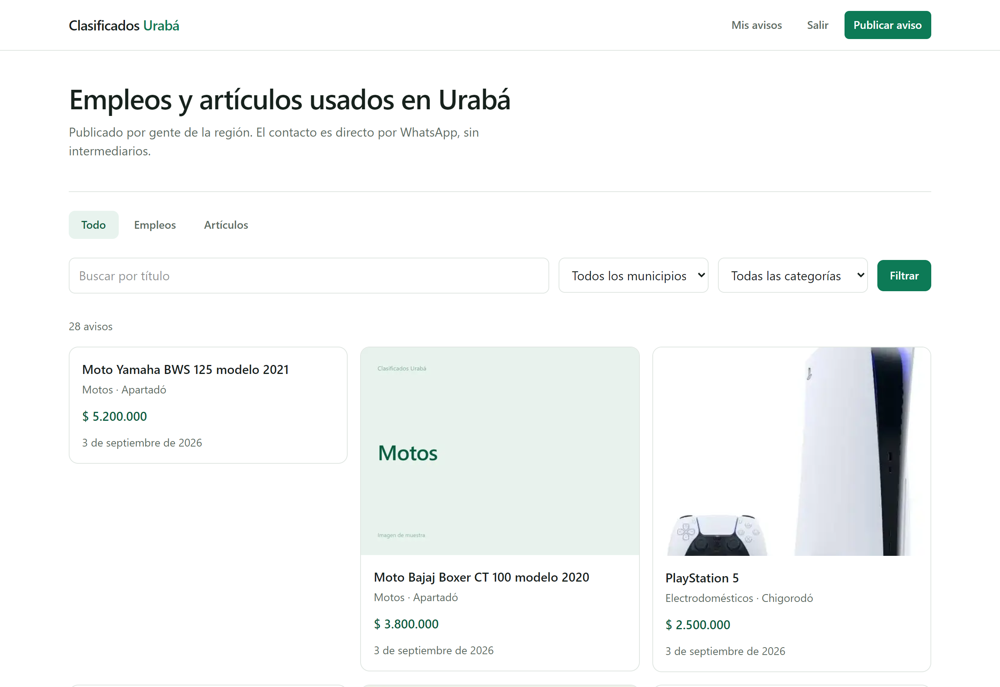
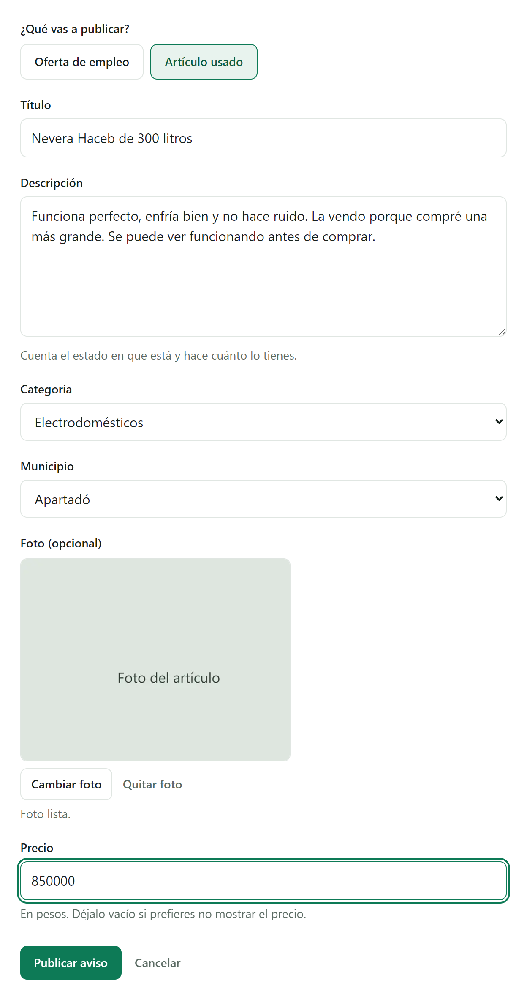
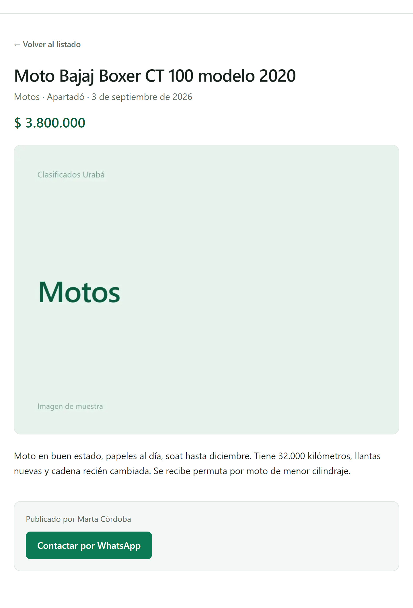
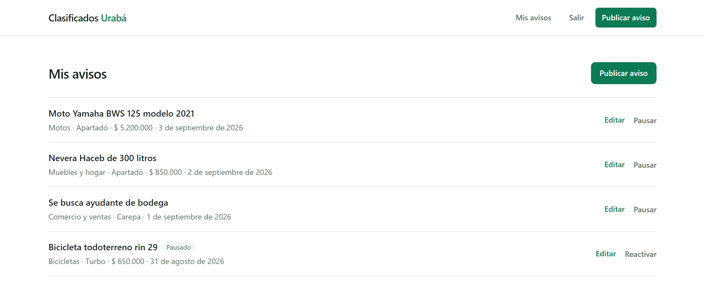

# Clasificados Urabá

Clasificados regionales de empleos y artículos usados para los once municipios de la subregión de Urabá, en Antioquia.

## El problema

En Urabá no hay un lugar digital donde buscar trabajo o vender algo usado. Lo que hay son grupos de WhatsApp y páginas de Facebook, cada uno por su lado. Una oferta de empleo publicada el martes queda enterrada bajo cien mensajes el jueves, no se puede filtrar por municipio, y para encontrar una moto hay que leer todo el historial hacia atrás.

Esto lo centraliza en un listado con filtros y búsqueda, donde cada aviso tiene su propia URL y sigue estando ahí la semana siguiente.

## Demo

https://clasificados.byaleks.space/

## Qué hace

El listado es público: se ve sin registrarse. Se filtra por tipo, municipio y categoría, y se busca por título.



Para publicar hace falta una cuenta. El formulario cambia según lo que se publique: los artículos llevan precio y foto, las ofertas de empleo no. La foto se reduce en el navegador antes de subirse, porque las cámaras de celular sacan imágenes de varios megas y en el listado nunca se ven a más de 1600 px.



No hay mensajería interna. El aviso muestra un botón que abre WhatsApp con el número de quien publicó y un mensaje que ya menciona el aviso. En la zona el contacto pasa por ahí de todos modos, así que meter un chat propio en el medio solo agregaba fricción.



Cada usuario administra lo suyo: crea, edita y pausa sus propios avisos.



## Stack

- **Next.js 15** con App Router y Server Actions
- **TypeScript**
- **Tailwind v4** (tokens en CSS, sin archivo de configuración)
- **Prisma 7** sobre **PostgreSQL** en Neon
- **Vercel Blob** para las fotos, con subida directa desde el navegador
- Autenticación propia: bcrypt para las contraseñas y un JWT firmado con jose en una cookie httpOnly

## Correr el proyecto local

```bash
git clone https://github.com/AleksCol/clasificados-uraba.git
cd clasificados-uraba
cp .env.example .env
```

Llenar las cuatro variables del `.env`:

| Variable | Qué es |
| --- | --- |
| `DATABASE_URL` | Cadena de conexión de Neon **con pooler**. La usa la aplicación. |
| `DIRECT_DATABASE_URL` | La misma base **sin** `-pooler` en el host. La usan solo las migraciones: PgBouncer en modo transacción no soporta los advisory locks que necesita Prisma. |
| `AUTH_SECRET` | Secreto para firmar la cookie de sesión. Generar con `node -e "console.log(require('crypto').randomBytes(32).toString('base64url'))"`. |
| `BLOB_READ_WRITE_TOKEN` | Token de un store de Vercel Blob **con acceso público**. Con un store privado las fotos responden 403 a quien no tenga credenciales, y el listado es público. |

Después:

```bash
npm install
npx prisma migrate dev     # crea las tablas
npm run db:seed            # categorías (la aplicación las necesita)
npm run db:seed-demo       # opcional: 24 avisos de muestra
npm run dev
```

Los avisos de muestra apuntan todos a un número de WhatsApp de relleno. Para usar otro: `WHATSAPP_DEMO=3001234567 npm run db:seed-demo`. Se borran con `npm run db:seed-demo:limpiar`.

## Pruebas

```bash
npm run dev        # en otra terminal
npm run pruebas
```

Cinco suites end-to-end que corren contra la base y el store reales, no contra mocks: autenticación, propiedad de los avisos, listado y filtros, fotos, y una de navegador con puppeteer-core sobre el Edge del sistema para lo que no se ve por HTTP (errores de consola de React y si un enlace realmente navega). Las cuentas de prueba usan el dominio `@prueba.local` y la limpieza alcanza solo a esas.

## Decisiones técnicas

Un aviso tiene tipo (empleo o artículo) y una categoría, y la categoría también tiene tipo. Nada impide en principio guardar una oferta de empleo con la categoría "Motos". En vez de dejar eso en manos de la validación de la aplicación, la llave foránea es compuesta: `avisos(categoriaId, tipo)` referencia `categorias(id, tipo)`. La combinación inválida la rechaza Postgres, no un `if`. La aplicación igual valida antes para dar un mensaje entendible, pero si esa validación se rompe la base sigue siendo consistente.

La verificación de dueño no es leer el aviso, comprobar el `usuarioId` y después escribir: entre esas dos operaciones hay una ventana. Las mutaciones usan `updateMany` con el filtro de propiedad en la misma consulta —`where: { id, usuarioId }`— así que un aviso ajeno simplemente no actualiza ninguna fila y la acción responde que no existe. La página de edición aplica el mismo filtro al leer y devuelve 404, sin revelar si el aviso existe.

## Búsqueda

La búsqueda ignora tildes y mayúsculas: escribir `camion` encuentra "Camión", y `necocli` encuentra "Necoclí". No es un detalle cosmético — la gente publica y busca desde el celular, donde poner tildes es incómodo, y una búsqueda que exige escribir "Necoclí" con acento no sirve para nada.

Se resuelve guardando una copia normalizada del título (sin tildes, en minúsculas) y comparando normalizado contra normalizado. Se descartó la extensión `unaccent` de Postgres porque Prisma no puede expresar `unaccent(titulo) ILIKE ...` en su query builder: habría obligado a reescribir toda la consulta filtrada en SQL crudo, con los cuatro filtros y la paginación, perdiendo el tipado.
